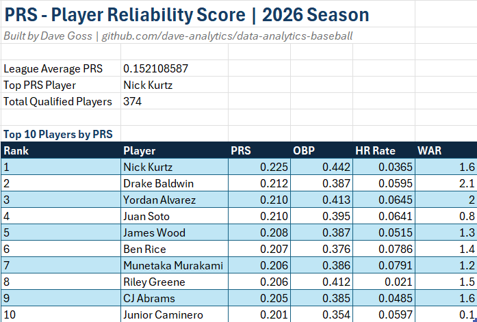
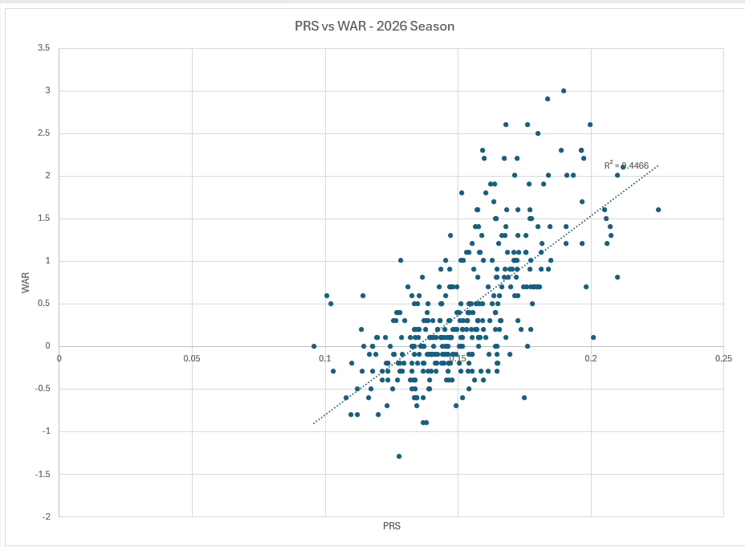

# data-analytics-baseball

Sports Analytics Portfolio | Dave Goss
Python · SQL · pandas · Excel · MLB Stats API

linkedin.com/in/davidrgoss

---

## About

Self-directed data analytics learning journey targeting sports analyst 
roles in the Nashville market. This repo documents the full progression 
from Python fundamentals through original statistical research.

---

## Projects

### PRS — Player Reliability Score
An original MLB statistic measuring offensive reliability.
Combines weighted hitting metrics, age-adjusted availability, 
and an injury resilience modifier built from game log data.
Validated at r = 0.675 against 2026 WAR across 375 qualified players.

📁 [/prs](./prs)

### Infield Weekly Report
Live MLB Stats API report pulling current standings, 
batting leaders, and team stats. Built with Python and requests.

📁 [/infield-report](./infield-report)

### Pitcher Tracker
Yahoo Fantasy API integration tracking pitcher usage 
and performance using OAuth2 authentication.

📁 [/pitcher-tracker](./pitcher-tracker)

### Learning Files
Python, pandas, and SQL review files documenting 
Phase 1 and Phase 2 of the analytics roadmap.

📁 [/learning](./learning)

---

## Dashboard

### PRS Rankings — Top 10 Players

### PRS vs WAR Correlation

---

## Tech Stack
- Python 3.14
- pandas · matplotlib · requests · fuzzywuzzy
- MLB Stats API ·
