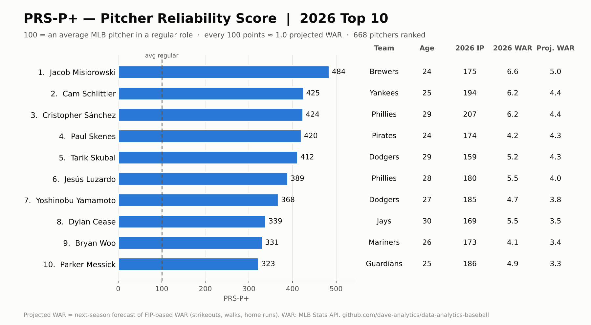

# data-analytics-baseball

Sports Analytics Portfolio | Dave Goss
Python · SQL · pandas · Excel · MLB Stats API

linkedin.com/in/davidrgoss

---

## About

Self-directed data analytics learning journey targeting sports analyst 
roles in the Nashville market. This repo documents the full progression 
from Python fundamentals through original statistical research.

---

## Projects

### PRS+ — Player Reliability Score
An original MLB statistic measuring reliable all-around value:
how good a player is × how much he actually plays, on an index
where 100 = an average MLB regular. Backtested over 21 seasons:
on the 11 seasons it was never tuned on, PRS+ beats the Marcel
projection system in 9 (r = 0.669 vs 0.644 against next-season WAR).
Pitcher version **PRS-P+** beats Marcel in 10 of 11 unseen seasons,
with a smaller average miss in all 11.

📁 [/prs](./prs)

### Infield Weekly Report
Weekly fantasy rankings for C, 1B, 2B, 3B, and SS from the live
MLB Stats API. Scores on-base ability, power, and expected starts
(z-scored, regressed to the mean), filters out injured players,
and runs for any week: `python infield_report.py --start 2026-05-04`.

📁 [/infield-report](./infield-report)

### Pitcher Tracker
Yahoo Fantasy API integration tracking pitcher usage 
and performance using OAuth2 authentication.

📁 [/pitcher-tracker](./pitcher-tracker)

### Learning Files
Python, pandas, and SQL review files documenting 
Phase 1 and Phase 2 of the analytics roadmap.

📁 [/learning](./learning)

---

## Dashboard

### PRS+ Rankings — 2026 Top 10

### PRS+ vs. Marcel — 21 Seasons of Forecasts

### PRS-P+ Pitcher Rankings — 2026 Top 10

---

## Tech Stack
- Python 3.14
- pandas · numpy · matplotlib · requests
- MLB Stats API · Baseball Reference
