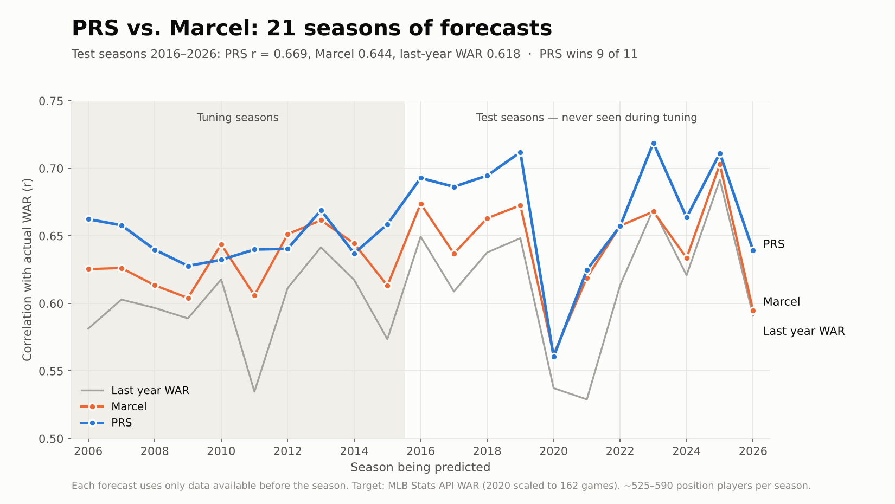
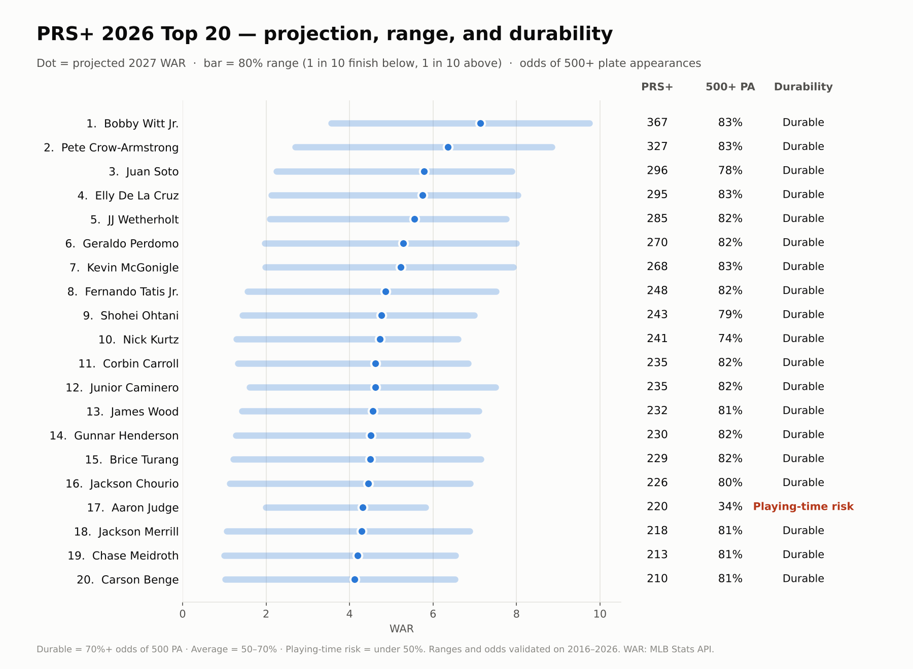
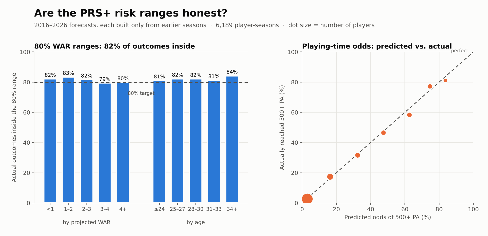

# PRS+ — Player Reliability Score

**An original baseball statistic built from scratch in Python.**

## What Is PRS+?

PRS+ measures how much **total value** you can count on getting from an MLB position player next season — not just how good he is, but how reliably he'll be on the field delivering it.

**How to read it:** 100 = an average MLB regular. 200 = twice the reliable value of an average regular. Every 100 points is roughly **1.9 projected WAR** (100 ≈ 1.9, 200 ≈ 3.8, 300 ≈ 5.6).

Most fantasy baseball and front office metrics measure peak performance. PRS+ measures *dependable* performance. A player who posts elite numbers in 90 games is less valuable than one who posts solid numbers in 155 games. PRS+ quantifies that gap.

## The Core Idea

PRS+ = **how good he is** × **how much he plays**

1. **Hitting** — on-base ability, power, and overall batting value over the last three seasons, plus minor-league performance for young players
2. **Age Curve** — young players improve faster than veterans decline
3. **Base-Running, Defense & Position** — runs added on the bases and in the field, plus credit for playing a harder position
4. **Availability** — how many plate appearances the player has actually delivered over the last three seasons

## Methodology

### Hitting
On-base percentage, home run rate, and total batting runs from the last three seasons, weighted toward the most recent season. For players 27 and under, Triple-A and Double-A stats are blended in after translating them down to MLB level, so a prospect with a short MLB track record isn't judged on a handful of big-league at-bats alone. Each stat is standardized (z-scored) before blending, so every component counts as much as its weight says.

### Age Curve
Players are adjusted by their age during the season (MLB's June 30 convention). The curve is asymmetric: players below their late-20s peak are expected to improve, while veterans decline.

### Base-Running, Defense & Position
Three-season base-running runs, fielding runs, and positional value (a shortstop is worth more than a first baseman with the same bat) from the MLB Stats API, converted to a per-600-plate-appearance rate and standardized.

### Availability
Plate appearances over the last three seasons, weighted toward the most recent. A missed season counts as zero — that's the reliability in Player Reliability Score. Seasons before a player's MLB debut are skipped rather than counted as missed, young players get a bump for the playing time they tend to earn, and projections are capped at a full, healthy season. The shortened 2020 season is scaled to a 162-game pace.

## Validation — 21 Seasons vs. Marcel

PRS+ is tested the hard way: build it using **only data available before a season**, then check how well it predicts that **next** season's WAR. It is compared against **Marcel**, the standard public baseline projection system (Tom Tango), and against simply using last season's WAR.

All settings were tuned on **2006–2015 only**. The **2016–2026** seasons were never seen during tuning.



| Test seasons 2016–2026 (11 seasons) | **PRS+** | Marcel | Last year's WAR |
|---|---|---|---|
| Correlation with actual WAR (r) | **0.669** | 0.644 | 0.618 |
| Average miss (WAR) | **0.86** | 0.89 | 0.93 |
| Within 2 WAR of actual | **88.9%** | 88.3% | 87.7% |
| Top 25 that finished top 25 in WAR | **10.7** | 10.4 | 9.7 |
| Seasons PRS+ beat Marcel (r / average miss) | — | 9 of 11 / 10 of 11 | — |

<sub>~525–590 position players per season with 200+ plate appearances over the prior three seasons. Target: MLB Stats API WAR (2020 scaled to 162 games). Players with no MLB plate appearances the next season count as 0 WAR.</sub>

**Key findings:**
- PRS+ beats Marcel in **9 of the 11 seasons it never saw**, with a smaller average miss in 10 of 11.
- **Availability was the biggest single improvement** over a rate-only score; base-running, defense, and position were next.
- **No age bias.** Marcel underrates players 23 and under by about 0.6 WAR and overrates players 34+ by about 0.35 WAR; PRS+ misses every age group by about the same small amount.
- **Where it's even:** at the very top of the rankings PRS+ and Marcel identify stars about equally well, and neither can foresee true breakouts — players whose past numbers gave no hint of a 6–7 WAR season.

## Risk: Range and Durability

Two players can share the same projection with very different risk. Every PRS+ forecast comes with:

- **An 80% range** for next-season WAR — 1 in 10 players should finish below it, 1 in 10 above. Ranges are sized by projection level, age, MLB experience, and playing-time history, and the downside and upside are sized separately.
- **Odds of 500+ plate appearances** next season, with a **durability label**: **Durable** (70%+), **Average** (50–70%), or **Playing-time risk** (under 50%).



**Are they honest?** Tested on 2016–2026, with each season's ranges and odds built only from earlier seasons:



- **82% of actual outcomes landed inside the 80% ranges** — 79–84% for every projection tier and every age group, and 80–86% in every full season (2020's 60-game season: 72%).
- **Playing-time odds match reality:** players given 75% reached 500 PA 77% of the time; players given 32%, 32% of the time.
- **Durability separates playing time:** Durable players reached 500 PA 79% of the time and fell under 300 PA only 5–9% of the time; Playing-time-risk players reached 500 PA 33–49% of the time.
- **What it can't do:** durability does *not* predict who underperforms their WAR forecast. Among players with similar projections, Durable and Playing-time-risk players lost 2+ WAR at about the same rate — performance swings are mostly noise. So PRS+ reports a range for performance and odds for playing time, and makes no "volatile vs. steady" performance call the data doesn't support.

### Version history
- **v1** was validated against same-season, partial-year WAR (r = 0.675). That mostly confirmed PRS and WAR were measuring the same two months of hitting, not that PRS predicts anything. Its resilience modifier (OBP before vs. after an absence) didn't improve forecasts and was removed.
- **v2–v4** added availability, defense/base-running/position, and young-player handling, validated on 2024–2026.
- **v5 (PRS+)** re-tuned everything on 2006–2015, added overall batting value, switched to the PRS+ index, and was tested on 11 unseen seasons against Marcel.
- **v6** added 80% WAR ranges, playing-time odds, and durability labels, validated on 2016–2026.

## Sample Output — PRS+, 2026


```
rank  name                 age   PRS+   proj. WAR   80% range    500+ PA   durability
1     Bobby Witt Jr.        26    367      7.1      3.6 – 9.7      83%     Durable
2     Pete Crow-Armstrong   24    327      6.4      2.7 – 8.8      83%     Durable
3     Juan Soto             27    296      5.8      2.2 – 7.9      78%     Durable
4     Elly De La Cruz       24    295      5.7      2.1 – 8.0      83%     Durable
5     JJ Wetherholt         23    285      5.6      2.1 – 7.8      82%     Durable
17    Aaron Judge           34    220      4.3      2.0 – 5.8      34%     Playing-time risk
```

### Does PRS+ predict next season? 2025 forecasts vs. actual


## Tech Stack

- **Python 3.14**
- **pandas / numpy** — data manipulation, weighting, and backtesting
- **requests** — MLB Stats API calls (no authentication required)
- **MLB Stats API** — MLB and minor-league stats, base-running/fielding/positional run values, WAR, player bios (2003–2026)
- **matplotlib** — charts

## What's Next

- **2027 preseason rankings** — published before Opening Day and graded at season's end
- **PRS-P** — a pitcher version
- **Tableau dashboard** — interactive PRS+ leaderboard by position

## About

Built by Dave Goss as part of a self-directed data analytics learning journey targeting sports analytics roles in the Nashville market. This project applies Python, pandas, API integration, feature engineering, and out-of-sample validation to an original research question.

Portfolio: [github.com/dave-analytics/data-analytics-baseball](https://github.com/dave-analytics/data-analytics-baseball)  
LinkedIn: [linkedin.com/in/davidrgoss](https://linkedin.com/in/davidrgoss)

---

*Note: Full formula weights, tuning methodology, and implementation details are proprietary.*
