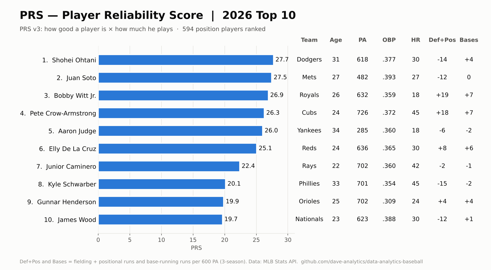
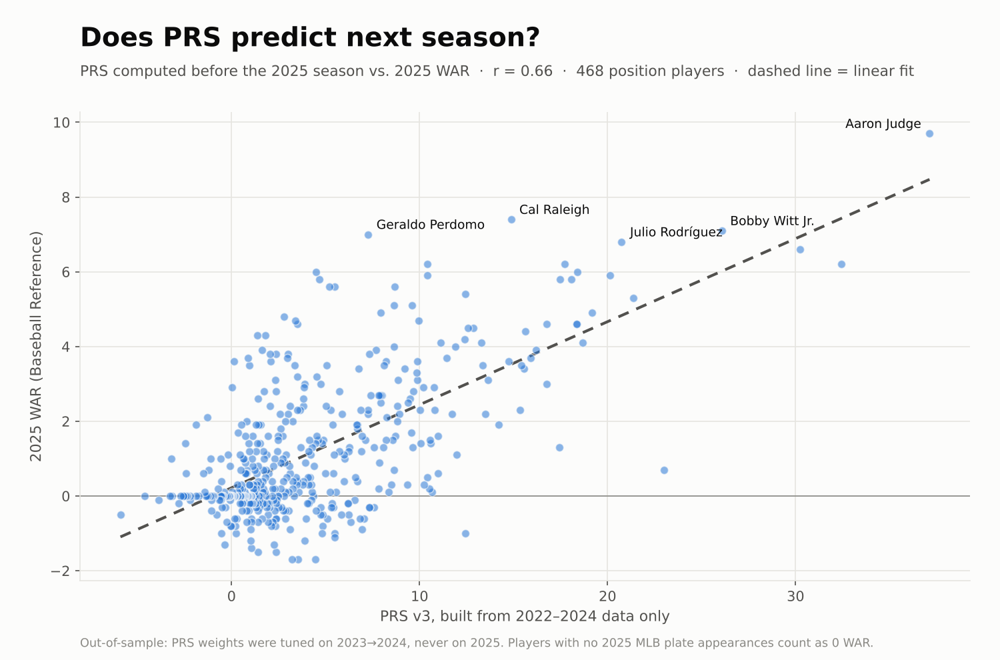

# PRS — Player Reliability Score

**An original baseball statistic built from scratch in Python.**

## What Is PRS?

PRS (Player Reliability Score) measures how much **total value** you can count on getting from an MLB position player next season — not just how good he is, but how reliably he'll be on the field delivering it.

Most fantasy baseball and front office metrics measure peak performance. PRS measures *dependable* performance. A player who posts elite numbers in 90 games is less valuable than one who posts solid numbers in 155 games. PRS quantifies that gap.

## The Core Idea

PRS = **how good he is** × **how much he plays**

1. **Hitting Quality** — on-base ability and power, measured over the last three seasons
2. **Age Adjustment** — accounts for the natural aging curve of MLB players
3. **Base-Running, Defense & Position** — runs added on the bases and in the field, plus credit for playing a harder position
4. **Availability** — how many plate appearances the player has actually delivered over the last three seasons

The result is a single score that reflects both a player's all-around value and how likely he is to be in the lineup to provide it.

## Methodology

### Hitting Quality
On-base percentage and home run rate from the last three seasons, weighted toward the most recent season. Rates are regressed toward league average, so a hot 150 plate appearances doesn't outrank a proven full season. Each stat is standardized (z-scored) before blending, so every component counts as much as its weight says.

### Age Adjustment
Players are adjusted by their age during the season (MLB's June 30 convention): younger players are expected to improve, older players to decline.

### Base-Running, Defense & Position
Three-season base-running runs, fielding runs, and positional value (a shortstop is worth more than a first baseman with the same bat) from the MLB Stats API, converted to a per-600-plate-appearance rate and standardized. Hitting still carries the most weight.

### Availability
Plate appearances over the last three seasons, weighted toward the most recent. A missed season counts as zero — that's the reliability in Player Reliability Score.

## Validation

PRS is tested the hard way: build it using **only data available before a season**, then check how well it predicts that **next** season's WAR (Wins Above Replacement, Baseball Reference). Each version was tuned on one season and tested on seasons it had never seen.

| PRS built from | Tested against | v1 | v2 (offense only) | **v3 (current)** | Prior-year WAR | Plain OPS |
|---|---|---|---|---|---|---|
| 2021–2023 | 2024 WAR | 0.43 | 0.58 | **0.63** *(tuning season)* | — | 0.32 |
| 2022–2024 | 2025 WAR | 0.46 | 0.57 | **0.66** | 0.66 | 0.35 |
| 2023–2025 | 2026 WAR* | 0.34 | 0.38 | **0.41** | 0.43 | 0.29 |

<sub>Pearson correlation (r), ~440–480 position players per season. \*2026 WAR is a partial-season snapshot (through late May), which lowers every correlation. Prior-year WAR = Baseball Reference WAR from the base season (not available for 2023).</sub>

**Key findings:**
- PRS v3 predicts next-season WAR at **r ≈ 0.66 on data it was never tuned on** — as well as last season's WAR itself, and better than MLB's own WAR figure (0.64).
- **Availability was the biggest single improvement** (about +0.12 r over a rate-only score).
- **Base-running, defense, and position added about +0.08 r**; each one helps on its own, with positional value contributing the most.
- The age adjustment adds real predictive value (about +0.05 r).

### What changed from v1
PRS v1 was validated against **same-season** 2026 WAR (r = 0.675), using a partial-season WAR file. That mostly confirmed that PRS and WAR were measuring the same two months of hitting, not that PRS predicts anything. Backtesting showed:
- v1's **resilience modifier** (OBP in the 15 games before vs. after an absence) did not improve predictions — 15-game windows are too small to separate a real bounce-back from luck — so it was removed.
- v1 had no true availability component; plate-appearance history alone predicted next-season WAR as well as v1 did.
- Batting average was dropped as largely redundant with OBP.
- v1 measured offense only, so it couldn't account for the defense, base-running, and positional value that WAR rewards.

## Tech Stack

- **Python 3.14**
- **pandas** — data manipulation and weighted calculations
- **requests** — MLB Stats API calls (no authentication required)
- **MLB Stats API** — season stats, base-running/fielding/positional run values, player bios
- **Baseball Reference** — WAR data for validation

## Sample Output — PRS v3, 2026

```
name                 team                    age   PA   OBP   HR   prs
Shohei Ohtani        Los Angeles Dodgers      31   618  .377   30  27.7
Juan Soto            New York Mets            27   482  .393   27  27.5
Bobby Witt Jr.       Kansas City Royals       26   632  .359   18  26.9
Pete Crow-Armstrong  Chicago Cubs             24   726  .372   45  26.3
Aaron Judge          New York Yankees         34   285  .360   18  26.0
```

## Dashboard (PRS v3)

### PRS Rankings — 2026 Top 10


### Out-of-Sample Validation — PRS (2022–24 data) vs. 2025 WAR, r = 0.66


## What's Next

- **PRS-P** — a pitcher version using ERA, strikeout rate, and innings pitched
- **Tableau dashboard** — interactive PRS leaderboard by position
- **Performance Resilience Score** — revisit resilience with larger samples (e.g. full months, minor-league returns) and keep it only if it improves the backtest

## About

Built by Dave Goss as part of a self-directed data analytics learning journey targeting sports analytics roles in the Nashville market. This project applies Python, pandas, API integration, feature engineering, and out-of-sample validation to an original research question.

Portfolio: [github.com/dave-analytics/data-analytics-baseball](https://github.com/dave-analytics/data-analytics-baseball)  
LinkedIn: [linkedin.com/in/davidrgoss](https://linkedin.com/in/davidrgoss)

---

*Note: Full formula weights, tuning methodology, and implementation details are proprietary.*
